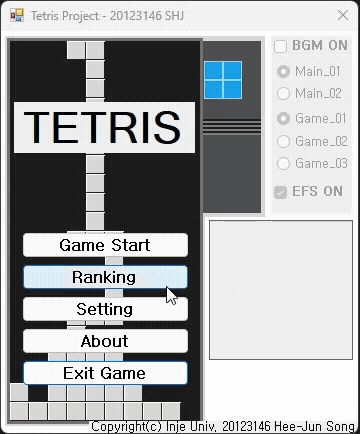
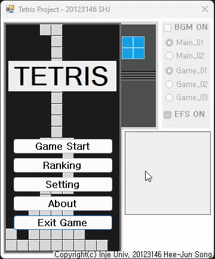
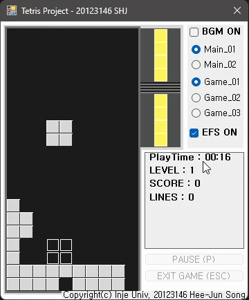
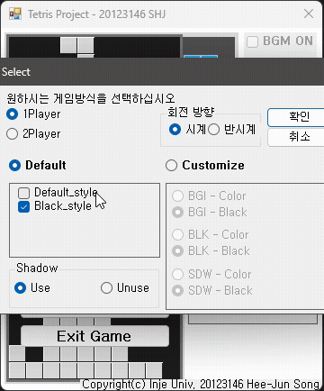
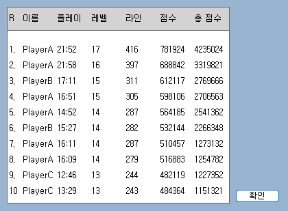

# 🎮 Tetris Project (2012)

C#과 Windows Forms로 개발된 클래식 테트리스 게임입니다.

## ✨ 주요 기능

- ~~**싱글/멀티플레이어 모드**: 1P 또는 2P 대전 플레이~~ (2P 미지원)
- **랭킹 시스템**: 최고 점수 기록 및 순위 등록
- **그림자 블록**: 블록 착지 위치 미리보기
- **홀드 기능**: 현재 블록을 저장하고 나중에 사용
- **커스터마이징**: 배경, 블록, 그림자 색상 변경 가능
- **키 설정**: 플레이어별 조작키 커스터마이징
- **배경음악**: 게임 플레이 중 BGM 지원
- **레벨 시스템**: 레벨에 따른 속도 증가
- **콤보 시스템**: 연속 라인 클리어 시 추가 점수

## 📸 스크린샷

### 게임 전체 미리보기


### 메뉴에서 게임 시작


### 게임 플레이


### 설정 화면


### 랭킹 시스템


## 🎯 조작법

### Player 1 (기본 설정)
| 동작 | 키 |
|------|-----|
| 시계방향 회전 | ↑ |
| 반시계방향 회전 | 한자 |
| 소프트 드롭 | ↓ |
| 좌측 이동 | ← |
| 우측 이동 | → |
| 하드 드롭 | Space |
| 홀드 | Shift |
| 일시정지 | P |

> 📌 **설정 메뉴에서 키를 변경할 수 있습니다.**

## 🖥️ 시스템 요구사항

- **OS**: Windows 7 이상
- **Framework**: .NET Framework 4.0 이상
- **IDE**: Visual Studio 2010 이상

## 🚀 실행 방법

1. Visual Studio에서 `Tetris Project.sln` 파일을 엽니다.
2. 솔루션을 빌드합니다 (F6 또는 Ctrl+Shift+B).
3. 프로그램을 실행합니다 (F5).

## 📁 프로젝트 구조

```
Tetris Project/
├── Form1.cs           # 메인 게임 폼 및 게임 루프
├── BlockMove.cs       # 블록 이동 및 회전 로직
├── BlockCreate.cs     # 블록 생성 로직
├── Blockset.cs        # 블록 셋 및 프리뷰/홀드 관리
├── Draw.cs            # 그래픽 렌더링
├── SCORECLASS.cs      # 점수 계산 및 레벨 관리
├── RankingClass.cs    # 랭킹 시스템
├── Setting.cs         # 키 설정 관리
├── Select.cs          # 게임 옵션 선택 화면
├── RegameForm.cs      # 게임 오버/재시작 화면
└── Resources/         # 이미지 및 사운드 리소스
```

## 🎨 게임 모드

### 스타일 모드
- **기본 스타일**: 밝은 배경의 클래식 테트리스
- **다크 스타일**: 어두운 배경의 모던한 느낌

### 플레이어 모드
- **1P 모드**: 혼자서 최고 점수에 도전
- **2P 모드**: 친구와 함께 대결

## 📊 점수 시스템

- 블록을 아래로 이동할 때마다 점수 획득
- 라인을 클리어할수록 높은 점수 획득
- 연속 콤보 시 추가 보너스
- 플레이 시간과 레벨에 따른 최종 점수 계산

## 📝 라이선스

이 프로젝트는 인제대학교 학술 목적으로 제작되었습니다.

---

**© 2012 송희준 (인제대학교 20123146)**